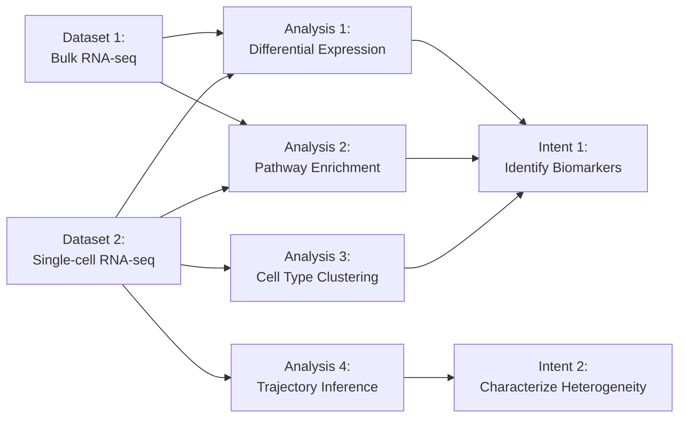

---
**Navigation**: [Project Overview](project_overview.md) | [Intent Overview](intent_overview.md) | [Dataset Overview](dataset_overview.md) | [Analysis Overview](analysis_overview.md) | [Dependencies](dependencies.md) | [Project Resources](project_resources.md)

---

# Dependencies
<!-- Overview diagram (mermaid format) of links between intents, datasets and analyses -->

The diagram below summarises the interconnections between this project's intents, datasets and analyses. 

## Dependency Diagram

Edit the diagram below to suit your project, or run `/biospec.diagram`. 

<!-- Update the diagram above to reflect your project's actual dependencies -->

## Links to Individual Components

### Dataset Links
<!-- Links to individual dataset files -->
- [Dataset {n}: {Name/Identifier}](datasets/dataset-1.md)
- [Dataset {n}: {Name/Identifier}](datasets/dataset-2.md)

### Intent Links
<!-- Links to individual intent files -->
- [Intent {n}: {Short Identifier}](intents/intent-1.md)
- [Intent {n}: {Short Identifier}](intents/intent-2.md)

### Analysis Links

- [Analysis {n}: {Descriptor}](analyses/analysis-1.md)
- [Analysis {n}: {Descriptor}](analyses/analysis-2.md)