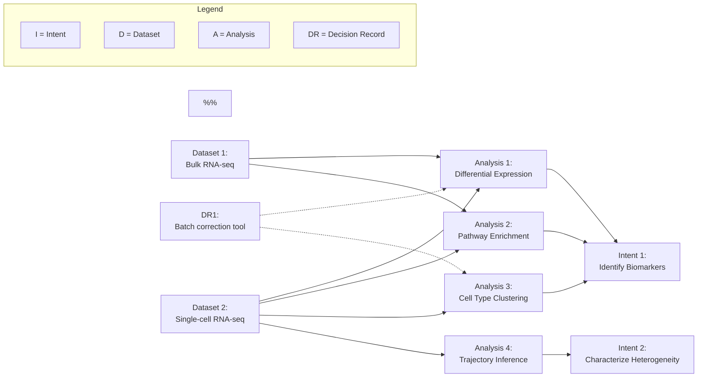

---
**Navigation**: [Project Overview](project_overview.md) | [Intent Overview](intent_overview.md) | [Dataset Overview](dataset_overview.md) | [Analysis Overview](analysis_overview.md) | [Dependencies](dependencies.md) | [Project Resources](project_resources.md)

---

# Project Graph
<!--
Overview diagram (mermaid format) of the relationships between intents,
datasets, analyses, and decisions for this project.

Filename note: kept as `dependencies.md` for backwards compatibility; the
content covers all component relationships, not only dependencies.
-->

<!--
Source of truth: this file is a **derived view** of the cross-links recorded
in intent.md, dataset.md, analysis.md, decisions.md, and the three overview
summary tables. When in conflict, the per-component Related Components blocks
win. Regenerate or hand-update after meaningful changes to those files (see
`/biospec.diagram` if your project has tooling for this).
-->

The diagram below summarises the interconnections between this project's
intents, datasets, analyses, and decision records.

## Project Graph

Edit the diagram below to suit your project, or run `/biospec.diagram`.

<!-- Update the diagram above to reflect your project's actual relationships. -->

## See also

- [Intent Overview](intent_overview.md) — list of intents and their summaries.
- [Dataset Overview](dataset_overview.md) — list of datasets and their summaries.
- [Analysis Overview](analysis_overview.md) — list of analyses with priority and status.
- [Decisions Register](registers/decisions.md) — log of decision records (DR{n}).
