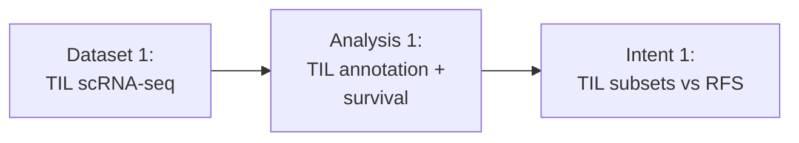

# Dependencies

## Links to Individual Components

### Dataset Links
- [Dataset 1: TIL scRNA-seq](datasets/dataset-1.md)

### Intent Links
- [Intent 1: TIL subsets vs RFS](intents/intent-1.md)

### Analysis Links
- [Analysis 1: TIL annotation + survival](analyses/analysis-1.md)
