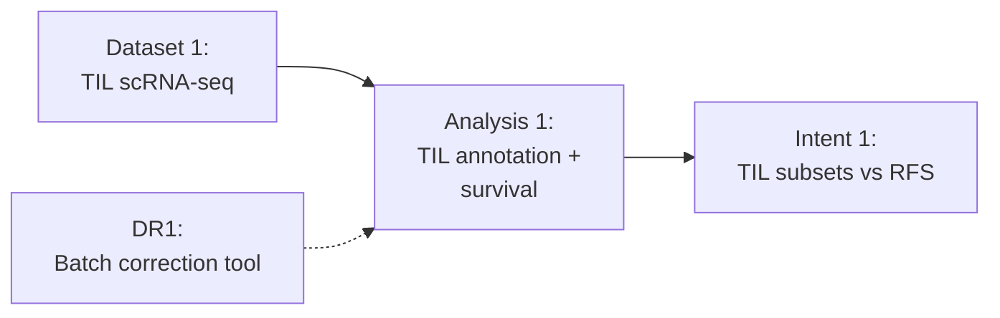

# Project Graph

## See also

- [Intent Overview](intent_overview.md)
- [Dataset Overview](dataset_overview.md)
- [Analysis Overview](analysis_overview.md)
- [Decisions Register](registers/decisions.md)
